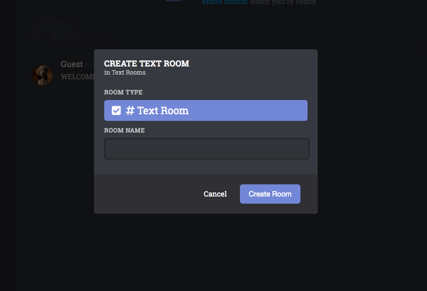

# Dissonance

[live demo](https://dissonanceapp.herokuapp.com/)

## Overview

Dissonance is a full stack clone of discord, a popular text and voice chatting service. First released in 2015 discord was released to help gamers easily have access to voice chat. 

## Technologies

Dissonance was built using React/Redux, and Javascript for the frontend; Ruby on Rails and PostgreSQL for the backend. Ruby on Rails Action Cable was used to implement the live chat feature.

## Features

### Users

* Users can signup and login

### Servers

* Servers that are created have a default general text room
* Users can create a new server, thus becoming the admin of that server
* The admin of the server can get the join link to that server
* Users can join an existing server through a join link

### Rooms

* All users within a server are "joined" to all rooms of that server
* The admin of a server can create new rooms

### Text Chat

* Users can post messages to a room

## Future features

* Private/direct messages
* Link up with aws so users can change their profile pictures